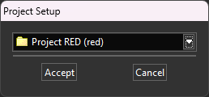
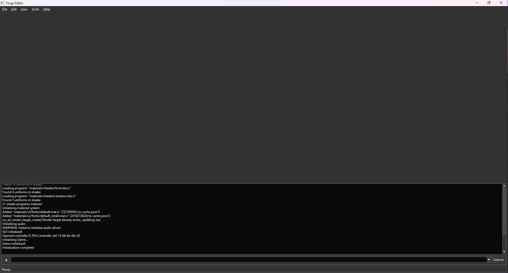

# Forge

Forge is the name of the editor used alongside APE. It can be used for creating new worlds, brushes, materials and models, as well as modifying project properties, viewing/importing content and much more.

When Forge is opened, it will first ask you to select or create a project.

By default, this will be relative to where Forge is being executed from, specifically it should resolve to your installation location, and then 'projects'. A project will only appear in the list of available projects if it has a 'projectName.prj.n'; so for instance, the base project has 'base.prj.n' under the 'base' directory, so the editor will pick this up and parse the 'prj.n' to fetch the settings for that particular project.

Likewise, if you choose to create a new project, it will also be created as a new folder under the 'projects' directory, which subsequently will include it's own '*.prj.n' file.

Once your project is open, it will mount the appropriate locations for you automatically, and you'll be left with an empty editor window.

From here you can now go into *File* in the top menu, and either choose to create or open an existing item. Of course, this isn't something we'll go into here but you can find a list of different categories below that will aid you with each of the individual editors available within.

- [World Editor](forge_world_editor.md)
- [Material Editor]()
- [Model Editor](forge_model_editor.md)

## Troubleshooting

### "Failed to find cook"

This error suggests that the cook executable is missing from your `runtime/<platform>/` directory. You'll either need to fetch a copy of the runtime again, being sure that the `cook` executable is present.

The cook executable is important as it will be used to convert content into a format that the engine accepts, among other tasks, so without it you will be unable to import certain types of files successfully.
